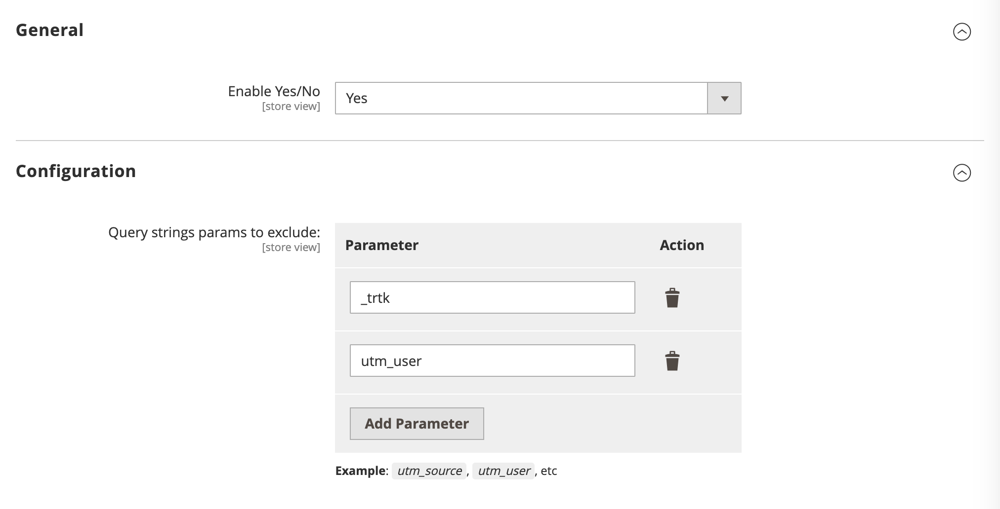

# Webscale Cache Exclusions 
Allows to set up and configure Cache Exclusions magento extension.

## Installation
To install extension - start with the following in magento root directory to add a repository:
```console
composer config repositories.webscale-cache-exclusions git https://github.com/webscale-networks/magento-cache-exclusions.git
```

To avoid issues with CI/CD and github add `"no-api": true` to the repo settings, so it looks like this:
```console
"webscale-cache-exclusions": {
    "type": "git",
    "url": "https://github.com/webscale-networks/magento-cache-exclusions.git",
    "no-api": true
}
```

Now require extension itself:
```console
composer require webscale-networks/magento-cache-exclusions
```

After composer installs the package run next magento commands:

```console
php bin/magento module:enable Webscale_CacheExclusions
php bin/magento setup:upgrade
bin/magento cache:clean
```

Once the extension is installed it can be configured in `Admin > Stores > Configuration > Webscale > Cache Exclusions`:



To exclude any node from the query string, just add it to the parameter list. 

**Example:**

In such URL: 
```
https://example.com/category/?utm_user=5c60ba87dbe4ea20747ddb6dad0f0a32d1d2d5ae&utm_source=Some+UTM+Source&utm_campaign=My+Campaign
``` 
the unique part is: `utm_user=5c60ba87dbe4ea20747ddb6dad0f0a32d1d2d5ae`.
To exclude it from magento cache lookup - add `utm_user` to the exclusions list, it will remove whole node, including value, from cache lookup and hash only:
```
https://example.com/category/?utm_source=Some+UTM+Source&utm_campaign=My+Campaign
```
